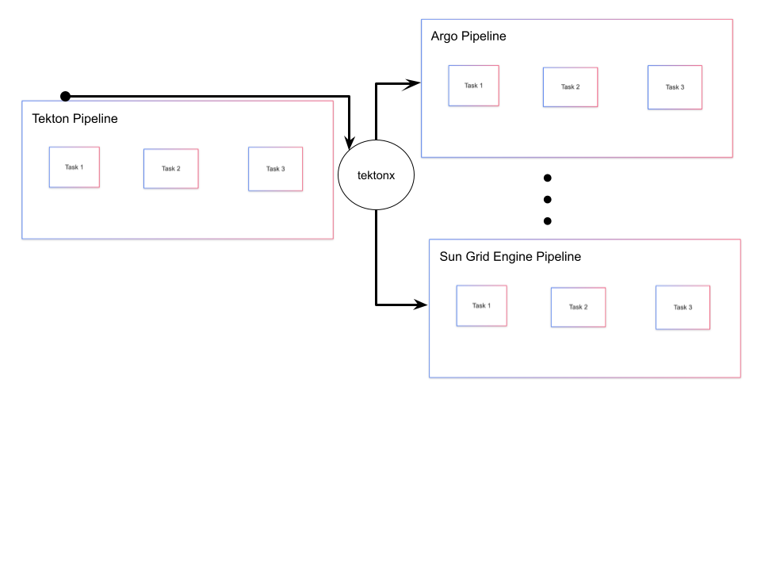
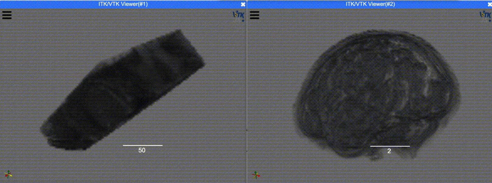
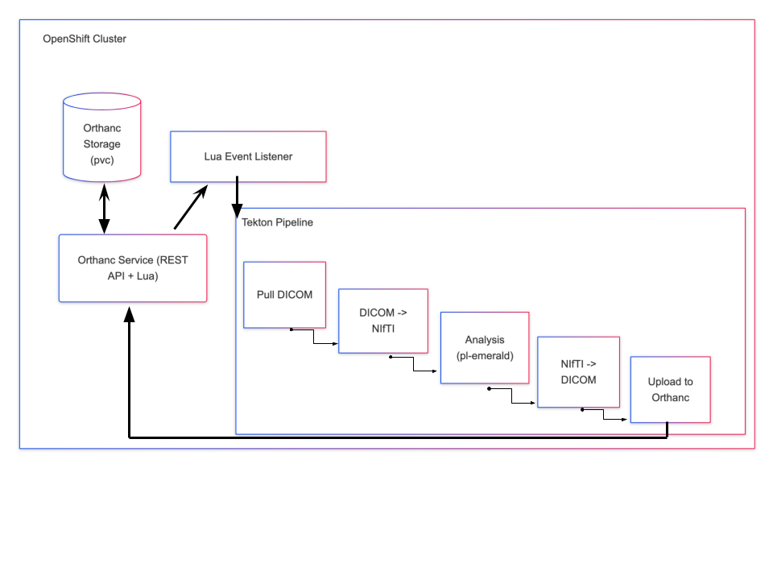

# EC528-Fall-2025-CloudNeuro-Tekton

## To the Cloud: Neuroscience Pipelines on Tekton

### Summary
In this project, we built an automated cloud-native neuroimaging pipeline on OpenShift and developed a workflow translation tool ("Rosetta Stone") that converts Tekton pipelines into multiple workflow languages (SLURM, Snakemake, Argo, Nextflow, WDL, etc.), improving reproducibility and interoperability across diverse compute environments.




### Table of Contents
- [Summary](#summary)
- [Problem Statement](#problem-statement)
- [Get Started](#get-started)
  - [Additional Setup Information](#additional-setup-information)
- [1. Vision and Goals Of The Project](#1-vision-and-goals-of-the-project)
- [2. Users/Personas Of The Project](#2-userspersonas-of-the-project)
- [3. Scope and Features Of The Project](#3-scope-and-features-of-the-project)
- [4. Solution Concept](#4-solution-concept)
  - [4.1 High-Level Architecture](#41-high-level-architecture)
    - [4.1.1 Multi-User or Concurrency Model](#411-multi-user-or-concurrency-model)
    - [4.1.2 State, Metadata, and Session Handling](#412-state-metadata-and-session-handling)
    - [4.1.3 Component Communication](#413-component-communication)
    - [4.1.4 Connection to Interoperability and the Final Deliverable](#414-connection-to-interoperability-and-the-final-deliverable)
  - [4.2 Design Implications and Discussion](#42-design-implications-and-discussion)
- [5. Why these Technologies Were Chosen](#5-why-these-technologies-were-chosen)
- [6. Acceptance Criteria](#6-acceptance-criteria)
- [7. Release Planning](#7-release-planning)
  - [Release Calendar](#release-calendar)
- [8. Next Steps & Future Work](#8-next-steps--future-work)
- [DEMO VIDEO + SLIDES](#demo-video--slides)

### Problem Statement
While neuroimaging research produces software tools with the potential to improve clinical outcomes and reduce physicians’ workload, the inefficiencies in usability and integration hinder the realization of this potential. Existing proprietary automation and AI platforms are prohibitively expensive, often requiring not only steep licensing fees but also in-house developers to customize them. Even when available, such tools impose steep learning curves and disrupt established clinical routines, leaving busy clinicians unable to adopt them. Usability and seamless integration are therefore essential prerequisites for translating research advances into practice.

Cloud-native platforms like Kubernetes and Tekton present an opportunity to modernize this ecosystem by offering scalable compute, standardized interfaces, and event-driven automation. However, adopting these technologies in neuroscience remains difficult: researchers must grapple with containerization, orchestration, and pipeline specification languages that vary across institutions and workflow engines.

This fragmentation creates two key problems:

1. **Lack of a reference cloud-native workflow** that shows how end-to-end neuroimaging tasks (e.g., receiving DICOM, converting to NIfTI, running preprocessing modules) can be automated and executed in a modern container-oriented environment.

2. **Lack of interoperability across workflow systems**. Pipelines written for one platform (Tekton, Snakemake, Nextflow, ChRIS, Argo, Sun Grid Engine, etc.) cannot easily be reused on another. This blocks inter-team collaboration, as manually rewriting pipelines is a time-consuming and error-prone process.

## Get Started

**NOTE**: Several of the setup commands such as *xcode-select --install*, Homebrew (*brew install* …), and macOS-specific path configuration for Java, assume a **macOS** environment.

Users on Linux or Windows (WSL) can still run the translator (tektonx) and most workflows, but must adjust the installation steps accordingly:

1. **Prereqs**
   - Git
   - Python 3.11+ (`python3 --version`)
   - [uv](https://github.com/astral-sh/uv):
     ```bash
     curl -LsSf https://astral.sh/uv/install.sh | sh
     ```
   - Install runtimes:
     ```bash
     xcode-select --install                                 # install make (macOS)       
     uv tool install snakemake                              # install snakemake
     uv run pip install chris_plugin                        # install ChRIS
     brew install argo                                      # install argo
     
     brew install nextflow         
     # install nextflow                         
     brew install openjdk@17                                
     export JAVA_HOME=$(/usr/libexec/java_home -v 17)
     export PATH="$JAVA_HOME/bin:$PATH"
     # optional if no other versions of java exist in your environment

     brew install cromwell                                  # install Cromwell
     ```

   - Docker (optional) if you build/run the ChRIS container example
   - kubectl/oc (optional) if deploying to OpenShift for Orthanc/Tekton

2. **Clone + env**
   ```bash
   git clone https://github.com/EC528-Fall-2025/CloudNeuro-Tekton
   cd CloudNeuro-Tekton/tektonx
   uv sync
   ```

3. **Convert a Tekton example**
Available Targets: 
   - bash
   - make
   - snakemake
   - chris
   - argo
   - nextflow
   - wdl
   - slurm
   - sungrid
   
   The example below uses snakemake.
   ```bash
   uv run python -m tektonx.cli examples/pipeline-complete.yaml --target snakemake
   ```

4. **Save artifacts (example: Snakemake)**
   ```bash
   uv run python -m tektonx.cli examples/pipeline-complete.yaml --target snakemake --out dist/Snakefile
   ```

5. **Run tests**
   ```bash
   uv run pytest
   ```
   This is a minimal test suite: only the bash and Snakemake renderers are actually executed, while other targets are validated via string checks.
   
   #### To run on an engine targeting a certain backend:
    ```bash
    cd /CloudNeuro-Tekton/tektonx
    ```


    ###### GNU Make
    ```bash
    uv run python -m tektonx.cli examples/curl-test.yaml --target make --out dist/Makefile
    mkdir -p /tmp/gnu_make_test
    WORKDIR=/tmp/gnu_make_test make -f dist/Makefile

    ```

    ###### Snakemake
    ```bash
    uv run python -m tektonx.cli examples/pipeline-complete.yaml --target snakemake
    mkdir -p /tmp/snake_make_test
    XDG_CACHE_HOME=/tmp TMPDIR=/tmp WORKDIR=/tmp/snake_make_test snakemake -s dist/Snakefile --cores 1
    ```

    ###### ChRIS
    **Note:** Docker must be running to run this.
    ```bash
    uv run python -m tektonx.cli examples/pipeline-dag.yaml --target chris --out dist/dag_app.py
    docker build -f examples/Dockerfile.minichris -t dag-chris .
    mkdir -p /tmp/chris-input /tmp/chris-output /tmp/chris-work
    docker run --rm \
    -v /tmp/chris-input:/input:rw \
    -v /tmp/chris-output:/output:rw \
    -v /tmp/chris-work:/work:rw \
    -e WORKDIR=/work \
    dag-chris --workdir /work /input /output
    ```
    
    ###### Argo Workflow
    **Note:** You have to be logged into the OC cluster for this run, and have appropriate permissions to submit an Asrgo job.
    ```bash
    uv run python -m tektonx.cli examples/pipeline-complete.yaml --target argo --out /tmp/argo-flow.yaml
    argo submit /tmp/argo-flow.yaml -n chris-students-c9344e --watch

    ```
    ###### Nextflow
    ```bash
    uv run python -m tektonx.cli examples/pipeline-complete.yaml --target nextflow --out /tmp/main.nf
    WORKDIR=/tmp/nf_run TMPDIR=/tmp nextflow run /tmp/main.nf
    ```
    ###### WDL/Cromwell
    ```bash
    uv run python -m tektonx.cli examples/pipeline-complete.yaml --target wdl --out /tmp/workflow.wdl
    cromwell run /tmp/workflow.wdl
    ```
    ###### Sungrid
    ```bash
    uv run python -m tektonx.cli examples/pipeline-complete.yaml --target sungrid --out /tmp/sge-task.sh
    ```
    ###### Slurm
    ```bash
    uv run python -m tektonx.cli examples/pipeline-complete.yaml --target slurm --out /tmp/slurm_demo.sh
    ```

### Additional Setup Information

This guide provides the essential steps required to deploy the core infrastructure components used in our OpenShift-based pipeline environment. These components include Orthanc, which serves as our database/system of record for medical imaging data (DICOM and NIfTI), and the Tekton-based workflow pipelines that orchestrate end-to-end processing within OpenShift.

The goal of this setup is to give you a reproducible environment—whether you are deploying the stack for development, testing, or full production. The instructions below assume you have access to an OpenShift cluster and the necessary permissions to create namespaces, deploy workloads, and run pipelines. For most users, each component only needs to be deployed once, with additional notes provided for replication or customization.

1. **Deploy Orthanc on OpenShift (Picture Archiving and Communication System/PACS)**

   Orthanc is our database, and source of truth for medical data whether it is a DICOM file or a NIfTI file. You can access our currently hosted Orthanc service [here](https://orthanc-chris.apps.shift.nerc.mghpcc.org/ui/app/#/).

   To host your own Orthanc instance, this step only needs to be done **once**, for replication purposes additional instructions are provided below. 

      - Prereq: `oc` logged into a cluster with rights to create namespaces/objects.
      - Create a project/namespace (e.g., `oc new-project orthanc`).
      - Apply manifest or use Helm helper:
      **Use the Helm wrapper script (recommended)**
         This script:
         * Switches to the correct OpenShift namespace
         * Installs / upgrades the Orthanc Helm release
         * Applies your helm-orthanc-values.yaml
         * Creates (or reuses) the OpenShift Route
         * Waits for the deployment to stabilize
      ```bash
         # NOTE: edit namespace in this script
         # Helm wrapper
         ./scripts/helm-orthanc.sh
      ```
      **Manual Helm install**
         If you prefer to run the equivalent commands directly:
      ```bash
         # Add chart repo (only needed once)
         helm repo add fnndsc https://fnndsc.github.io/charts
         helm repo update

         # Deploy or upgrade Orthanc
         helm upgrade --install orthanc fnndsc/orthanc \
         -f scripts/helm-orthanc-values.yaml \
         -n <namespace>
      ```
      Expose the route (only first time):
      ```bash
      oc expose svc v-orthanc --port=http -n <namespace>
      ```

   - Confirm pod/service: `oc get pods,svc` in the namespace; port-forward or expose as needed.

2. **Deploy Tekton pipeline on OpenShift**
  
   - Ensure Tekton operators are installed on the cluster.
   - Apply a Pipeline/PipelineRun (start from `examples/`) This example:
     ```bash
     oc apply -f /CloudNeuro-Tekton/OpenShift-Automation/download-convert.yaml
     ```
   - Run/monitor:
     ```bash
     tkn pipeline start <name>
     tkn pipelinerun logs -f <run>
     ```

For OpenShift environment setup details see `docs/setup.md`; for Orthanc/Tekton manifests see `scripts/` and `Plugin/`.

### 1. Vision and Goals Of The Project
Our minimum goal was to demonstrate the execution of neuroimaging research software, such as FreeSurfer or pl-Emerald, on OpenShift using Tekton/OpenShift pipelines. This remained as the foundation of our project:  packaging existing neuroimaging tools so they can run efficiently and reliably in a cloud-native environment, thereby automating pipeline execution and facilitating computational reproducibility through consistent containerized environments.

As the project developed, the minimum goal evolved into creating a reference cloud-native neuroimaging workflow that can:
* Receive imaging data from a DICOM source (Orthanc)
* Automatically trigger pipeline execution upon DICOM series upload
   1. Perform DICOM &rarr; NIfTI conversion
   2. Run a preprocessing step (e.g., *pl-emerald* fetal brain masking)
   3. Perform processed NIfTI &rarr; DICOM conversion
   4. Store modified DICOM series back into the PACS server in a consistent, reproducible way

This produced a complete, automated, end-to-end workflow inside OpenShift.

This cloud-native workflow was an essential first-milestone: it provided the reproducible Tekton pipeline definition from which further development could proceed. Completing this deployment ensured we has a working example of a real neuroimaging pipeline expressed in Tekton.

Over the semester, however, the project evolved toward a broader and more impactful goal: improving interoperability of neuroimaging workflows across compute environments. Many research labs use SLURM, Sungrid, Snakemake, Argo, etc. instead of Tekton. This creates major friction when pipelines must be shared across institutions or migrated between HPC and cloud systems.

To address this fragmentation, the project includes a workflow "Rosetta Stone" translator (*tektonx*) that converts Tekton pipelines into several alternative workflow languages.

Thus, the project can be understood in two layers:
1. Cloud-Native Foundation: a fully working Tekton neuroimaging workflow with a DICOM server used both as a demonstration and as the canonical input format.
2. Interoperability Deliverable (Final Output): a translation tool that converts Tekton pipelines into multiple workflow specifications, improving reproducibility and multi-institution collaboration.


We emphasized two guiding principles to address the broader challenges identified in clinical adoption:
* **Scalability and Infrastructure Interoperability** – Cloud computing provides elastic, pay-as-you-go compute capacity that is especially valuable for institutions without dedicated HPC infrastructure, lowering the barrier for smaller or resource-limited hospitals to run advanced neuroimaging pipelines. At the same time, institutions with existing HPC systems may see less value in cloud elasticity. For these cases, interoperability becomes crucial. Translating Tekton pipelines into formats such as SLURM or Argo, ensures that pipelines can run across diverse infrastructures and integrate with existing systems. This principle increases usability for our customer segment.
* **Transparency and Trust** – Existing proprietary platforms impose steep licensing fees for products that often remain opaque and require further customization. By building on open-source software and cloud-native standards such as Tekton, we enable transparency, interoperability, and community-driven trust, ensuring the software can be inspected, extended, and widely adopted.


### 2. Users/Personas Of The Project

**This project is not intended for clinicians directly, but for research computing teams and developers who integrate neuroimaging pipelines into cloud or HPC environments.**

Neuroimaging research is both computationally intensive and requires advanced technical knowledge of the Linux command-line (CLI). Cloud-native tools such as Kubernetes and Tekton provide opportunities for elastic compute and integration with clinical systems.

While our original proposed project focused on building a tool targeting clinicians, based on actual project development:

The system is a **reference cloud-native deployment** and **toolkit** intended for research computing teams.
* Researcher IT teams may modify and deploy this cloud-native workflow, using it as a template, in their own Kubernetes projects. A computing administrator, such as a Research IT team or a supervising cloud team, maintains the environment.

Neuroimaging research is both computationally intensive and requires advanced technical knowledge of the Linux command-line. Cloud-native tools such as Kubernetes and Tekton provide opportunities for elastic compute and integration with clinical systems. The personas differ based on those who are more interested in using cloud-native workflows, or interoperability. 

#### **Persona 1**: Research Scientist
* Role Description: A researcher who designs and interprets MRI analysis pipelines, but needs portability across systems with varying compute environments (e.g., SLURM, YAML, Argo Workflow, or ChRIS), especially when a collaborator's system does not natively support Tekton.

Key characteristics:
* Skilled in medicine, not Linux pipelines
* Prioritizes reproducibility and interoperability
* Collaborates with multi-institutional teams
* Needs fast, clear, useful imaging results without the technical setup

Responsibilities: 
* Proposes a workflow for neuroimaging pipeline to assist research efforts 
* Share workflows with collaborators in other environments  

These users interact with the outputs generated by the pipeline (NIfTI files, brain masks, etc.). They depend on reproducible results and minimal system overhead.

#### **Persona 2**: Research Engineer / Developer
* Role Description: An academic researcher and/or startup software developer who aims to disseminate and/or commercialize their software pipelines.

Key characteristics:
* Image processing software developer

Responsibilities:
* Provides resources to research computing team to package their software so that it can be used in a variety of target environments, including HPC and Kubernetes.

#### **Persona 3**: Research Computing Administrator
* Role Description: A member of the research team / overarching administration for multiple research teams. Primary role is managing the Kubernetes project, deploying Orthanc, configuring storage/authentication, and operating Tekton pipelines for chosen preprocessing steps.

Key characteristics:
* Skilled in cloud deployments and Kubernetes, not medicine

Responsibilities:
* Deploy and maintain the cloud-native environment
* Manage namespaces, PVCs, resource quotas, and secrets
* Ensure multiple users can submit studies without interfering with each other

### 3. Scope and Features Of The Project
The scope of this project is to demonstrate how neuroimaging pipelines can be executed reproducibly in cloud-native using Tekton on OpenShift, and provide a translation mechanism for interoperability across alternative workflow systems.

#### Core Features Implemented:

#### Cloud-Native Workflow
* Deployment of Orthanc on OpenShift with authentication and storage configuration
* A consolidated pipeline defined in a single Tekton YAML with stages for:
   * Downloading a DICOM series from Orthanc
   * Converting the series to NIfTI
   * Running the *pl-emerald* brain masking module
   * Reappending the DICOM series metadata and converting the NIfTI file to DICOM
   * Reuploading the processed DICOM series back to Orthanc

#### Event-Driven Automation
* A Lua script acting as an Orthanc event listener that triggers the Tekton pipeline automatically when a new study is uploaded
* Enabling "hands-off" workflow automation

#### Workflow Translation (Rosetta Stone)
* A Rosetta Stone pipeline translator executable, *tektonx*, converting Tekton pipelines into other workflow definition languages (Bash, Make, Snakemake, Argo, ChRIS, Nextflow, WDL/Cromwell, SLURM, Sun Grid Engine)
* Produces runnable / syntactically valid outputs for each system

#### Longevity and Usability
* Clear documentation and instructions for replicating our setup and using the produced toolkit

#### Out-of-Scope
Certain elements are out of scope for this project. We do not propose the following to be in-scope for this project:
* Building a full library of all possible neuroimaging tools
* Developing advanced data management system for long-term storage
* Optimizing performance for large-scale clinical use

### 4. Solution Concept

This project implements a cloud-native neuroimaging workflow using OpenShift, Orthanc, and Tekton, and extends it with a workflow translation tool that improves portability across compute environments. The solution combines containerization, event-driven orchestration, and workflow modeling to make neuroimaging pipelines reproducible and interoperable within a cloud-native environment.

#### 4.1 High-Level Architecture
**Global Architectural Structure of the Project:**
The project architecture centers on containerized neuroimaging workflows deployed in Red Hat OpenShift and orchestrated with Tekton pipelines, automatically triggered via an Orthanc Lua event script. 


At the high level, the architecture includes the following components:

1. **Data Ingestion (PACS / Orthanc)**: DICOM imaging data is uploaded into Orthanc, which serves as a research PACS within the OpenShift cluster.
2. **Automated Triggering (Lua Event Listener)**: When a new DICOM study is received and considered 'stable' for a patient, a Lua script running inside Orthanc sends a request to the Tekton API, initiating a new PipelineRun.
3. **Preprocessing**: The Tekton pipeline retrieves the corresponding DICOM series, converts it to NIfTI, and performs initial processing steps, like extracting metadata to prepare data for DICOM reconversion.
4. **Analysis**: Containerized neuroimaging tools, such as *pl-emerald*, execute brain-masking or other modules within Tekton tasks. These containers run in isolated pod environments for reproducibility. 
5. **Result Export**: Final outputs (NIfTI files, segmentations, logs) are stored in persistent volumes are automatically pushed back to Orthanc once converted back to the DICOM format.
6. **Monitoring and Logging**: OpenShift provides per-pod logs, while Tekton exposes task-level artifacts, enabling researchers to view detailed provenance for every execution.

The pipeline completes a full cycle of data ingestion, conversion, analysis, and output storage. This serves as the foundational reference workflow used for testing and validating cross-platform translations.

##### 4.1.1 Multi-User or Concurrency Model
To support multiple studies or users submitting data concurrently:
* Tekton automatically generates unique PipelineRun and TaskRun CRDs, ensuring each workflow execution is isolated.
* Workspaces backed by PVCs provide dedicated storage for each run
* Orthanc remains stateless with respect to pipeline execution, storing only DICOM series and not pipeline state.

This design allows the system to scale naturally with user activity and supports parallel runs without modification.

##### 4.1.2 State, Metadata, and Session Handling
* Tekton runs are stateless, meaning all required metadata (e.g., StudyInstanceUID, SeriesInstanceUID, PatientName) is passed directly into the pipeline from the Lua event listener.
* Data products and logs are stored in PVCs tied to the pipeline run.
* Orthanc retains only the imaging objects and identifying metadata.


##### 4.1.3 Component Communication
Communication between components occurs through well-defined interfaces:
* Orthanc &rarr; Tekton: Lua script sends an authenticated REST POST to trigger a Tekton PipelineRun once the patient series is stabilized.
* Tekton &rarr; Download Container: Pipelines call Orthanc's REST API to download DICOM series.
* Tekton &rarr; Convert Container: Pipelines use the *pl-dcm2niix* image to convert the DICOM series to NIfTI
* Tekton &rarr; Analysis Container: Tools like *pl-emerald* are invoked as container steps within tasks.
* Tekton &rarr; Convert Container: Pipelines use *pydicom, nibabel, and skimage* to convert the NIfTI file back to DICOM series format, with a sidecar for DICOM metadata.
* Tekton &rarr; Upload Container: Pipelines call Orthanc's REST API to upload DICOM series.

##### 4.1.4 Connection to Interoperability and the Final Deliverable
The end-to-end Tekton workflow is not only a functional pipeline but also serves as the canonical specification for the Rosetta Stone translator. By establishing a concrete, validated, cloud-native pipeline:
* The Tekton YAML provides a structured DAG from which translations are derived.
* The workflow ensures that pipeline logic is deterministic and portable.
* The workflow becomes a testbed for validating generated Snakemake, SLURM, Nextflow, Argo, WDL, ChRIS, and SGE equivalents.

Thus, the cloud-native deployment is both an instructional example and the foundation for cross-system interoperability.

#### 4.2 Design Implications and Discussion
The architectural design described in Section 4.1 carries several important implications for portability, scalability, and long-term maintainability of neuroimaging workflows. The discussion below outlines the rationale behind the major choices made in the implementation and how these decisions support the project’s goals of reproducibility and interoperability.

##### **Containerization**
Packaging the workflow components, including DICOM-to-NIfTI conversion utilities and analysis modules like pl-emerald, into containers ensures that every step of the pipeline executes in a controlled, consistent environment. This eliminates dependency conflicts that are common in neuroimaging workflows, enables deterministic re-execution, and allows the same pipeline to run on OpenShift clusters, local workstations, and HPC systems. The isolation between container steps also aligns with the multi-user model described in Section 4.1.1, preventing conflicts in shared environments.

##### **Tekton Pipelines**
Tekton provides a Kubernetes-native way of expressing workflows as explicit DAGs through Custom Resource Definitions. This structure offers modularity, transparent task-level execution, and clear provenance. The stateless execution model (Section 4.1.2) means pipeline runs can be easily repeated or parallelized, and Tekton’s separation of tasks into pods reinforces fault isolation. Importantly, Tekton’s strongly defined workflow representation also forms the basis for the Rosetta Stone translator, enabling consistent conversion of pipeline logic into other workflow formats used in HPC and cloud systems; This is particularly valuable in neuroimaging where workflows are often highly specialized and fragmented.

##### **PACS Integration and Data Ingestion Strategy **
The solution is designed to interface with PACS (Picture Archiving and Communication System), the DICOM (Digital Imaging and Communications in Medicine) standard widely used in hospitals worldwide.

Integrating Orthanc as the imaging entry point enables compatibility with DICOM-based clinical systems while keeping the architecture lightweight and research-friendly. Using Orthanc’s REST API for series downloads (Section 4.1.3) provides a simple, transport-agnostic mechanism for retrieving imaging data. The Lua-based event trigger creates an automated workflow that responds directly to new incoming studies, which is a common requirement in clinical and research imaging environments. The design is flexible enough to swap Orthanc for another PACS or data source without altering the pipeline structure.

##### Scalability and Computational Reproducibility
Running pipelines on OpenShift provides elastic scaling and workload isolation by default. Because each PipelineRun executes in its own pod(s) and uses its own workspace PVC (Section 4.1.1), multiple users can submit studies concurrently without interference. This isolation also enhances reproducibility: rerunning a pipeline with the same inputs and container versions produces identical outputs, a critical property for scientific workflows where reproducibility is a foundational requirement.

##### Interoperability and Motivation for the Rosetta Stone Translator
The cloud-native workflow developed in this project serves as both an operational pipeline and a canonical model for translation. Many research teams rely on heterogeneous systems—SLURM, Snakemake, WDL/Cromwell, Argo, Nextflow, ChRIS. Manually rewriting pipelines across these platforms is slow and error-prone. By designing the Tekton workflow with explicit tasks, parameters, and workspaces, the pipeline becomes a well-defined source-of-truth suitable for conversion into other workflow specifications. The Rosetta Stone translator builds on this clarity, improving portability across institutional boundaries and enabling workflows to move fluidly between cloud and HPC environments.

##### Limitations and Scope Boundaries
The system focuses on feasibility and reproducibility rather than production deployment. It does not implement EMR integration, large-scale image archival workflows, or advanced clinical UI features. Security, auditing, and medical compliance (HIPAA, audit trails) are not addressed in depth, as the environment is intended for research, not clinical operations. These limitations define a clear and reasonable boundary for the project’s scope while leaving room for future extensions.

### 5. Why these Technologies Were Chosen
#### Kubernetes / OpenShift
* Industry-standard container orchestration
* Namespaces and RBAC simplify multi-team research environments
* Built-in monitoring, logs, and scaling

#### Tekton Pipelines
* Cloud-native, Kubernetes-native workflow engine
* Represents pipelines as CRDs—supports modular DAGs
* Ideal for reproducible computations and event-driven workflows

#### Orthanc
* Lightweight, open-source DICOM server
* Easily customizable via Lua scripting
* Perfect for research environments without enterprise PACS access

#### FNNDSC Containers (pl-emerald, pl-dcm2niix)
* Well-maintained neuroimaging tools
* Designed for container-based execution

#### Rosetta Stone Translator
* Research environments vary wildly (HPC &rarr; cloud &rarr; hybrid)
* Enables portability and reproducibility across institutions
* Reduces time spent rewriting pipelines by hand

### 6. Acceptance Criteria
Our minimum goal is to demonstrate execution of neuroimaging research software on OpenShift using Tekton Pipelines:
* Orthanc (open-source medical imaging database) is successfully deployed on OpenShift with MRI data being retrieved and passed to the pipeline.
* A user can upload or access MRI data within the OpenShift environment.
* A neuroimaging analysis pipeline (e.g., *pl-emerald*) can be executed in OpenShift and completed without errors.
* Running the pipeline produces correct and verifiable outputs (e.g., processed images, segmentation maps, log files).
* Pipeline execution is automated through Tekton, so the user can trigger analysis with a single command or button.

From this point, our client provided a second goal, developing the Rosetta Stone Translator Program for our pipelines:
* A user can input a valid Tekton pipeline definition and receive an equivalent definition in at least one alternate workflow language (e.g., Argo, SLURM, or ChRIS YAML).
* The translated pipeline is syntactically valid and recognized by the target workflow system.
* At least one example Tekton pipeline from this project has been successfully translated and verified to run (or at least validate) in the target system.
* Instructions for running the translator are available and understandable by new users without prior knowledge of Tekton or the target system.

We met all of the acceptance criteria for both the minimum goal and extended goal. To summarize:

Minimum goal achievements:
* Orthanc deployed on OpenShift
* Tekton pipeline running DICOM &rarr; NIfTI &rarr; brain mask preprocessing &rarr; DICOM &rarr; Upload to Orthanc
* Automated triggering via Orthanc Lua API
* End-to-end reproducible pipeline with verifiable correct outputs

Extended goal achievements:
* A working Rosetta translation tool capable of converting Tekton pipelines into multiple workflow formats with a validated example (SGE tested via job submission, rest are validated syntactically)

### 7. Release Planning
This project was delivered through a series of incremental sprints, systematically building toward the core goal of enabling neuroscience research pipelines to run reproducibly on cloud-native infrastructure (OpenShift + Tekton), and then expanding the scope to achieve cross-platform workflow execution.

Each sprint produced a functional release with demonstrable functionality, allowing for course correction and alignment with mentor expectations.

### Release Calendar

| Sprint | Dates           | Goal / Deliverable                                                                                   |
|--------|-----------------|------------------------------------------------------------------------------------------------------|
| 1      | Sept 17 – Oct 1 | - Foundations: All team members set up NERC/OpenShift accounts <br> - Deploy a simple toy FaaS project <br> - Deploy Orthanc on OpenShift <br> - Establish agile process |
| 2      | Oct 2 – Oct 15  | - Run the MRI pipeline manually by plugging DICOM images onto Orthanc <br> - Automate Orthanc deployment with Helm on OpenShift |
| 3      | Oct 16 – Oct 29  | - Achieve Minimum Viable Workflow: Run the full end-to-end conversion pipeline on OpenShift / Tekton <br> - Implement DICOM &rarr; dcm2niix (NIfTI conversion) &rarr; pl-emerald (Brain Mask visualization) <br> - Orchestrate the pipeline using Tekton and explore Orthanc plugin triggering |
| 4      | Oct 30 – Nov 12  | - Develop Python CLI "Rosetta Translator" to convert Tekton YAML into executable scripts <br> - Implement NIfTI to DICOM conversion with metadata patching <br> - Set up local SLURM cluster using Docker for testing <br> - Refine Lua script triggering Tekton workflow upon DICOM series upload to Orthanc |
| 5      | Nov 13 – Nov 24  | - Automate the upload of the converted NIfTI &rarr; DICOM back to Orthanc, completing the full DICOM round-trip <br> - Implement and validate conversion for Sun Grid Engine (SGE) on the BC SCC (Shared Computing Cluster) <br> - Consolidate all components into Helm chart for reproducible deployment |
| Wrapup  | Nov 25 – Dec 6  | - Final deliverable: well-documented, executable Command-Line-Application via a GitHub repository <br> - Complete documentation <br> - Final demonstration preparation <br> - GitHub cleanup <br> - Reproducibility checks |

### 8. Next Steps & Future Work

#### 1. Production-Grade Observability Stack (Grafana, Loki, Promtail)

Late into the project, we began designing a full observability stack—including Loki (log storage), Promtail (log forwarding), and Grafana (visualization dashboards).

This would provide:
* Centralized log dashboards for Orthanc, Tekton tasks, and conversion containers
* Better debugging for failed pipeline runs
* Metrics and performance insight over time
* A more “production-like” environment consistent with clinical-grade workflows

**Why this is future work**:
Implementing this stack on NERC OpenShift required cluster-admin permissions (for LokiStack Operator, DaemonSets for Promtail, and persistent object storage), which were not available in the student environment. Additionally, OpenShift already provides basic pod-level logging, which reduced immediate need.

This remains a valuable next step for teams with:
* Their own Kubernetes cluster
* A more permissive OpenShift environment
* Plans for long-term or clinical-facing deployments

A folder of draft manifests and configuration references is preserved for continuation, housed within the `/observability` folder.

#### 2. Enhanced Clinical Workflow Integration
Future iterations could connect the pipeline more directly with hospital systems:
* EMR/EHR integration for metadata flow
* Automated report generation or notification workflows

These steps transition the system from “research automation” to “clinical workflow tool.”

#### 3. User-Facing Interface for Triggering and Monitoring Pipelines

Current pipeline interaction is via:
* Orthanc UI
* Tekton CLI (tkn)
* OpenShift console

Next steps could include a lightweight web UI, able to do the following:

* Upload DICOM → run pipeline → visualize outputs
* Monitor pipeline runs
* Display logs, masks, and converted images
* Provide download links to NIfTI or processed DICOM series

This would significantly improve accessibility for researchers and clinicians, as well as the supporting IT teams.

**In-Progress Work**
We began prototyping an embedded NiiVue viewer to visualize:
* Uploaded DICOM-converted NIfTI volumes
* Segmentation masks from pl-emerald
* Intermediate or final pipeline outputs

This work demonstrated feasibility (UI stub + viewer initialization), but was not completed due to time constraints and shifting priorities toward interoperability.

Finishing this feature would provide:
* In-browser 3D visualization
* Interactive overlays (e.g., mask on anatomical volume)
* One-click display of processed pipeline results

This remains a strong candidate for future development.

#### 4. Generalizing the Pipeline for Additional Neuroimaging Tools

The current workflow includes DICOM→NIfTI, pl-emerald, and NIfTI→DICOM conversion.
Future pipelines could incorporate:
* Multi-step fMRI preprocessing (fMRIPrep)
* FreeSurfer recon-all
* Diffusion MRI workflows
* ML/AI segmentation modules

Extending the reference pipeline improves the utility of the Rosetta Stone translator when translating complex DAGs.

### DEMO VIDEO + SLIDES
* [Conclusion Video](https://youtu.be/bNyoIzGDCmg) | [Conclusion Slides](https://docs.google.com/presentation/d/1yRukBc_kqaxNkKrhB08wA2n4tbKScR4swxLf2tJc5Ik/edit?usp=sharing)
* [Sprint 5 Demo Video](https://youtu.be/peyusJfjmyU) | [Sprint 5 Slides](https://docs.google.com/presentation/d/1mms0mldRULZ2PqBz8T1U1MMKErzfO6i0rrrQowGttq8/edit?usp=sharing)
* [Sprint 4 Demo Video](https://youtu.be/h3mNj9MzPz4) | [Sprint 4 Slides](https://docs.google.com/presentation/d/1597sFiXeIIOFcn6FjS6FHKkMCFbVPSVJSeMGVflTo8c/edit?usp=sharing)
* [Sprint 3 Demo Video](https://youtu.be/Eadwxo6tkok) | [Sprint 3 Slides](https://docs.google.com/presentation/d/14_BMxZWXjEcWHZb7_Ueva3HHOogPLTopwEevkK92Ahg/edit?usp=sharing)
* [Sprint 2 Demo Video](https://youtu.be/zQTAtZsyRKE) | [Sprint 2 Slides](https://docs.google.com/presentation/d/1-xbEBPg6GZEJfzY3CbQVmoMvFs2EpyrgMJETLsXBBCY/edit?usp=drivesdk)
* [Sprint 1 Demo Video](https://youtu.be/uLCBCPnanuE) | [Sprint 1 Slides](https://docs.google.com/presentation/d/1-ALj9ChKAheM6dkttzGoUHoqeJwRiWuEvDUVb_fA2Dg/edit?usp=sharing)