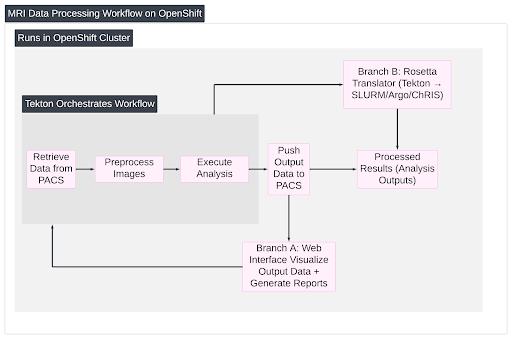

# EC528-Fall-2025-CloudNeuro-Tekton

## To the Cloud: Neuroscience Pipelines on Tekton

### DEMO VIDEO + SLIDES
* [Sprint 5 Demo Video](https://youtu.be/peyusJfjmyU) | [Sprint 5 Slides](https://docs.google.com/presentation/d/1mms0mldRULZ2PqBz8T1U1MMKErzfO6i0rrrQowGttq8/edit?usp=sharing)
* [Sprint 4 Demo Video](https://youtu.be/h3mNj9MzPz4) | [Sprint 4 Slides](https://docs.google.com/presentation/d/1597sFiXeIIOFcn6FjS6FHKkMCFbVPSVJSeMGVflTo8c/edit?usp=sharing)
* [Sprint 3 Demo Video](https://youtu.be/Eadwxo6tkok) | [Sprint 3 Slides](https://docs.google.com/presentation/d/14_BMxZWXjEcWHZb7_Ueva3HHOogPLTopwEevkK92Ahg/edit?usp=sharing)
* [Sprint 2 Demo Video](https://youtu.be/zQTAtZsyRKE) | [Sprint 2 Slides](https://docs.google.com/presentation/d/1-xbEBPg6GZEJfzY3CbQVmoMvFs2EpyrgMJETLsXBBCY/edit?usp=drivesdk)
* [Sprint 1 Demo Video](https://youtu.be/uLCBCPnanuE) | [Sprint 1 Slides](https://docs.google.com/presentation/d/1-ALj9ChKAheM6dkttzGoUHoqeJwRiWuEvDUVb_fA2Dg/edit?usp=sharing)

### Problem Statement
While neuroimaging research produces software tools with the potential to improve clinical outcomes and reduce physicians’ workload, the inefficiencies in usability and integration hinders the realization of this potential. Existing proprietary automation and AI platforms are prohibitively expensive, often requiring not only steep licensing feeds but also in-house developers to customize them. Even when available, such tools impose steep learning curves and disrupt established clinical routines, leaving busy clinicians unable to adopt them. Usability and seamless integration are therefore essential prerequisites for translating research advances into practice.

Cloud-native platforms like Kubernetes and Tekton present an opportunity to modernize this ecosystem by offering scalable compute, standardized inferfaces, and event-driven automation. However, adopting these technologoies in neurosceicen remains difficult: researchers must grapple with containerization, orchestration, and pipline specification languages that vary across institutions and workflow engines.

This fragmentation creates two key problems:

1. **Lack of a reference cloud-native workflow** that shows how end-to-end neuroimaging tasks (e.g., receiving DICOM, converting to NIfTI, running preprocessing modules) can be automated and exected in a modern container-oriented environment.

2. **Lack of interoperability across workflow systems**. Pipelines written for one platform (Tekton, Snakemake, Nextflow, ChRIS, Argo, etc.) cannot easily be reused on another. This blocks inter-team collaboration, as manually rewriting pipelines is a time-consuming and error-prone process.

## Get Started
1. **Prereqs**
   - Git
   - Python 3.11+ (`python3 --version`)
   - [uv](https://github.com/astral-sh/uv):
     ```bash
     curl -LsSf https://astral.sh/uv/install.sh | sh
     ```
   - Install runtimes:
     ```bash
     xcode-select --install                                 # install make (macOS)       
     uv tool install snakemake                              # install snakemake
     uv run pip install chris_plugin                        # install CHris
     brew install argo                                      # install argoflow
     
     brew install nextflow                                  # install nextflow
     brew install openjdk@17                                
     export JAVA_HOME=$(/usr/libexec/java_home -v 17)
     export PATH="$JAVA_HOME/bin:$PATH"

     brew install cromwell                                  # install Cromwell
     ```

   - Docker (optional) if you build/run the ChRIS container example
   - kubectl/oc (optional) if deploying to OpenShift for Orthanc/Tekton

2. **Clone + env**
   ```bash
   git clone https://github.com/EC528-Fall-2025/CloudNeuro-Tekton
   cd CloudNeuro-Tekton/tektonx
   uv sync
   ```

3. **Convert a Tekton example**
Avaliable Targets: 
   - bash
   - make
   - snakemake
   - chris
   - argo
   - nextflow
   - wdl
   - slurm
   - sungrid
   
   The example below uses snakemake.
   ```bash
   uv run python -m tektonx.cli examples/pipeline-complete.yaml --target snakemake
   ```

4. **Save artifacts (example: Snakemake)**
   ```bash
   uv run python -m tektonx.cli examples/pipeline-complete.yaml --target snakemake --out dist/Snakefile
   ```

5. **Run tests**
   ```bash
   uv run pytest
   ```
   This is a minimal test suite: only the bash and Snakemake renderers are actually executed, while other targets are validated via string checks.
   
   #### To run on an engine targeting a certain backend:
    ```bash
    cd /Users/trieutran/CloudNeuro-Tekton/tektonx
    ```


    ###### GNU Make
    ```bash
    uv run python -m tektonx.cli examples/curl-test.yaml --target make --out dist/Makefile
    mkdir -p /tmp/gnu_make_test
    WORKDIR=/tmp/gnu_make_test make -f dist/Makefile

    ```

    ###### Snakemake
    ```bash
    uv run python -m tektonx.cli examples/pipeline-complete.yaml --target snakemake
    mkdir -p /tmp/snake_make_test
    XDG_CACHE_HOME=/tmp TMPDIR=/tmp WORKDIR=/tmp/snake_make_test snakemake -s dist/Snakefile --cores 1
    ```

    ###### ChRIS
    **Note:** Docker must be running to run this.
    ```bash
    uv run python -m tektonx.cli examples/pipeline-dag.yaml --target chris --out dist/dag_app.py
    docker build -f examples/Dockerfile.minichris -t dag-chris .
    mkdir -p /tmp/chris-input /tmp/chris-output /tmp/chris-work
    docker run --rm \
    -v /tmp/chris-input:/input:rw \
    -v /tmp/chris-output:/output:rw \
    -v /tmp/chris-work:/work:rw \
    -e WORKDIR=/work \
    dag-chris --workdir /work /input /output
    ```
    
    ###### Argo Workflow
    **Note:** You have to be logged into the OC cluster for this run, and have appropriate permissions to submit a argo job.
    ```bash
    uv run python -m tektonx.cli examples/pipeline-complete.yaml --target argo --out /tmp/argo-flow.yaml
    argo submit /tmp/argo-flow.yaml -n chris-students-c9344e --watch

    ```
    ###### Nextflow
    ```bash
    uv run python -m tektonx.cli examples/pipeline-complete.yaml --target nextflow --out /tmp/main.nf
    WORKDIR=/tmp/nf_run TMPDIR=/tmp nextflow run /tmp/main.nf
    ```
    ###### WDL/Cromwell
    ```bash
    uv run python -m tektonx.cli examples/pipeline-complete.yaml --target wdl --out /tmp/workflow.wdl
    cromwell run /tmp/workflow.wdl
    ```
    ###### Sungrid
    ```bash
    uv run python -m tektonx.cli examples/pipeline-complete.yaml --target sungrind --out /tmp/sge-task.sh
    ```
    ###### Slurm
    ```bash
    uv run python -m tektonx.cli examples/pipeline-complete.yaml --target slurm --out /tmp/slurm_demo.sh
    ```

### Additional Setup Information

This guide provides the essential steps required to deploy the core infrastructure components used in our ChRIS-based processing environment. These components include Orthanc, which serves as our database/system of record for medical imaging data (DICOM and NIfTI), and the Tekton-based workflow pipelines that orchestrate end-to-end processing within OpenShift.

The goal of this setup is to give you a reproducible environment—whether you are deploying the stack for development, testing, or full production. The instructions below assume you have access to an OpenShift cluster and the necessary permissions to create namespaces, deploy workloads, and run pipelines. For most users, each component only needs to be deployed once, with additional notes provided for replication or customization.

1. **Deploy Orthanc on OpenShift (Picture Archiving and Communication System/PACS)**

Orthanc is our database, and source of truth for medical data whether it is a DICOM file or a NIFTI file. You can access our currently hosted Orthanc service [here](https://orthanc-chris.apps.shift.nerc.mghpcc.org/ui/app/#/).

To host your own Orthanc instance, this step only needs to be done **once**, for replication purposes additional instructions are provided below. 

   - Prereq: `oc` logged into a cluster with rights to create namespaces/objects.
   - Create a project/namespace (e.g., `oc new-project orthanc`).
   - Apply manifest or use Helm helper:
     ```bash
     oc apply -f scripts/orthanc.yaml
     oc apply -f scripts/orthanc_config.yaml
     # OR Helm wrapper
     ./scripts/helm-orthanc.sh
     ```
   - Confirm pod/service: `oc get pods,svc` in the namespace; port-forward or expose as needed.

2. **Deploy Tekton pipeline on OpenShift**
  
   - Ensure Tekton operators are installed on the cluster.
   - Apply a Pipeline/PipelineRun (start from `examples/`) This example:
     ```bash
     oc apply -f /CloudNeuro-Tekton/OpenShift-Automation/download-convert.yaml
     ```
   - Run/monitor:
     ```bash
     tkn pipeline start <name>
     tkn pipelinerun logs -f <run>
     ```

For OpenShift environment setup details see `docs/setup.md`; for Orthanc/Tekton manifests see `scripts/`.

### 1. Vision and Goals Of The Project
Our minimum goal was to demonstrate the execution of neuroimaging research software, such as FreeSurfer or PL-Emerald, on OpenShift using Tekton/OpenShift pipelines. This remained as the foundation of our project:  packaging existing neuroimaging tools so they can run efficiently and reliably in a cloud-native environment, thereby automating pipeline execution and facilitating computational reproducibility through consistent containerized environments.

As the project developed, the primary goal evolved into creating a reference cloud-native neuroimaging workflow that can:
* Receive imaging data from a DICOM source (Orthanc)
* Automatically trigger pipeline execution upon DICOM series upload
   1. Perform DICOM &rarr; NIfTI conversion
   2. Run a preprocessing step (e.g., *pl-emerald* fetal brain masking)
   3. Perform processed NIfTI &rarr; DICOM conversion
   4. Store modified DICOM series back into the PACS server in a consistent, reproducible way

This produced a complete, automated, end-to-end workflow inside OpenShift.

This cloud-native workflow was an essential first-milestone: it provided the reproducible Tekton pipeline definition from which further development could proceed. Completing this deployment ensured we has a working example of a real neuroimaging pipeline expressed in Tekton.

Over the semester, however, the project evolved toward a broader and more impactful goal: improving interoperability of neuroimaging workflows across compute environments. Many research labs use SLURM, Sungrid, Snakemake, Argo, etc. instead of Tekton. This creates major friction when pipelines must be shared across institutions or migrated between HPC and cloud systems.

To address this fragmentation, the project includes a workflow "Rosetta Stone" translator (*tektonx*) that converts Tekton pipelines into several alternative workflow languages.

Thus, the project can be understood in two layers:
1. Cloud-Native Foundation: a fully working Tekton neuroimaging workflow with a DICOM server used both as a demonstration and as the canonical input format.
2. Interoperability Deliverable (Final Output): a translation tool that converts Tekton pipelines into multiple workflow specifications, imrpoving reproducibility and multi-institution collaboration.


We emphasized two guiding principles to address the broader challenges indentified in clinical adoption:
* **Scalability and Infrastructure Interoperability** – Cloud computing provides elastic, pay-as-you-go compute capacity that is especially valuable for institutions without dedicated HPC infrastructure, lowering the barrier for smaller or resource-limited hospitals to run advanced neuroimaging pipelines. At the same time, institutions with existing HPC systems may see less value in cloud elasticity. For these cases, interoperability becomes crucial. Translating Tekton pipelines into formats such as SLURM or Argo, ensures that pipelines can run across diverse infrastructures and integrate with existing systems. This principle increases usability for our customer segment.
* **Transparency and Trust** – Existing proprietary platforms impose steep licensing fees for products that often remain opaque and require further customization. By building on open-source software and cloud-native standards such as Tekton, we enable transparency, interoperability, and community-driven trust, ensuring the software can be inspected, extended, and widely adopted.


NOTE TO SELF: THIS CAN BE ADDED IN A FUTURE WORKS SECTION
* Usability and Clinical Accessibility  – Automation in the cloud is only the first step. For clinicians to truly benefit, tools must be intuitive, low-friction, and aligned with existing workflows. Future work may focus on building a user-facing platform for triggering pipeline execution, monitoring progress, and visualizing outputs. This layer transforms containerized pipelines into a usable clinical tool, addressing the steep learning curves and workflow disruptions that currently prevent adoption.

### 2. Users/Personas Of The Project
Neuroimaging research is both computationally intensive and requires advanced technical knoledge of the Linux command-line (CLI). Cloud-native tools such as Kubernetes and Tekton provide opportunities for elastic compute and integration with clinical systems.

While our original proposed project focused on building a tool targeting clinicians, based on actual project development:

The system is a **reference cloud-native deployment** and **toolkit** intended for research computing teams.
* Researcher IT teams may modify and deploy this cloud-native workflow, using it as a template, in their own Kubernetes projects. A computing administrator, such as a Research IT team or a supervising cloud team, maintains the environment.

Neuroimaging research is both computationally intensive and requires advanced technical knowledge of the Linux command-line. Cloud-native tools such as Kubernetes and Tekton provide opportunities for elastic compute and integration with clinical systems. The personas differ based on those who are more interested in using cloud-native workflows, or interoperability. 

#### **Persona 1**: Research Scientist
* Role Description: A researcher who designs and interprest MRI analysis pipelines, but needs portability across systems with varying compute environments (e.g., SLURM, YAML, Argo Workflow, or ChRIS), especially when the system does not natively support Tekton.

Key characteristics:
* Skilled in medicine, not Linux pipelines
* Prioritizes reproducibility and interoperability
* Collaborates with multi-institutional teams
* Needs fast, clear, useful imaging results without the technical setup

Responsibilities: 
* Proposes a workflow for neuroimaging pipeline to assist research efforts 
* Share workflows with collaborators in other environments  

These users interact with the outputs generated by the pipeline (NIfTI files, brain masks, etc.). They depend on reproducible results and minimal system overhead.

#### **Persona 2**: Research Engineer / Developer
* Role Description: An academic researcher and/or startup software developer who aims to disseminate and/or commercialize their software pipelines.

Key characteristics:
* Image processing software developer

Responsibilities:
* Provides resources to research computing team to package their software so that it can be used in a variety of target environments, including HPC and Kubernetes.

#### **Persona 3**: Research Computing Administrator
* Role Description: A member of the research team / overarching administration for multiple research teams. Primary role is managing the Kubernetes project, deploying Orthanc, configuring storage/authentication, and operating Tekton pipelines for chosen preprocessing steps.

Key characteristics:
* Skilled in cloud deployments and Kubernetes, not medicine

Responsibilities:
* Deploy and maintain the cloud-native environment
* Manage namespaces, PVCs, resource quotas, and secrets
* Ensure mutiple users can submit studies without interfering with each other

### 3. Scope and Features Of The Project
The scope of this project is to demonstrate how neuroimaging pipelines can be executed reproducibly in cloud-native using Tekton on OpenShift, and provide a translation mechanism for interoperability across alternative workflow systems.

#### Core Features Implemented:

#### Cloud-Native Workflow
* Deployment of Orthanc on OpenShift with autentication and sotrage configuration
* A consolidated pipelien defined in a single Tekton YAML with stages for:
   * Downloading a DICOM series from Orthanc
   * Converting the series to NIfTI
   * Running the *pl-emerald* brain masking module
   * Reappending the DICOM series metadata and converting the NIfTI file to DICOM
   * Reuploading the processed DICOM series back to Orthanc

#### Event-Driven Automation
* A Lua script acting as an Orthanc event listener that triggers the Tekton pipeline automatically when a new study is uploaded
* Enabling "hands-off" workflow automation

#### Workflow Translation (Rosetta Stone)
* A Rosetta Stone pipeline translator executable, *tektonx*, converting Tekton pipelines into other workflow definition languages (Snakemake, Argo, ChRIS, Nextflow, WDL/Cromwell, SLURM, Sun Grid Engine)
* Produces runnable / syntactically valid outputs for each system

#### Longevity and Usabilty
* Clear documentation and instructions for replicating our setup and using the produced toolkit

#### Out-of-Scope
Certain elements are out of scope for this project. We do not propose the following to be in-scope for this project:
*  Building a full library of all possible neuroimaging tools
* Developing advanced data management system for long-term storage
* Optimizing performance for large-scale clinical use

### 4. Solution Concept

#### 4.1 High-Level Architecture
**Global Architectural Structure of the Project:**
The project architecture centers on containerized neuroimaging workflows deployed in Red Hat OpenShift and orchestrated with Tekton pipelines. 


At the high level, the architecture includes the following components:

1. **Data Ingestion (PACS)**: Imaging data is retrieved from a clinical image database (e.g., PACS) deployed inside OpenShift.
2. **Preprocessing**: The pipeline performs standard image preparation steps to ensure data is ready for analysis.
3. **Analysis**: Containerized neuroimaging tools execute the analysis (e.g., segmentation, measurement, or other workflows).
4. **Result Export**: Processed data, derived imaging outputs, and reports are pushed back into the clinical database, making them accessible for clinicians and researchers.
5. **Pipeline Orchestration (Tekton)**: Tekton defines and automates the execution of each stage, ensuring reproducibility and consistency across runs.
6. **Monitoring and Logging**: OpenShift and Tekton provide job monitoring, error logging, and reproducibility verification.

The cloud-native workflow completes a full cycle of data ingestion, preprocessing, and output storage. This served as the foundational pipeline used for interoperabiltiy testing and translation.

Our translator was built to export Tekton pipeline definitions into formats such as Argo, SLURM batch scripts, or ChRIS YAML, enabling use across multiple environments. This 

#### Design Implications and Discussion 
* **Containerization**: Packaging software such as FreeSurfer and preprocessing steps in containers ensures portability and computational reproducibility. This avoids dependency conflicts and allows the same pipeline to run consistently across diverse environments, from research clusters to cloud platforms.
* **Tekton Pipelines**: Using Tekton allows the team to represent complex neuroimaging workflows as DAGs. This provides modularity and automation, but more importantly, it improves interoperability in a domain where most workflows are ad hoc and non-standardized. Tektok’s cloud-native standards make pipelines easier to share, adapt, and integrate across teams and institutions, which is particularly valuable in neuroimaging where workflows are often highly specialized and fragmented.
* **PACS Integration**: The solution is designed to interface with PACS (Picture Archiving and Communication System), the DICOM (Digital Imaging and Communications in Medicine) standard widely used in hospitals worldwide. Orthanc can serve as an open-source reference implementation, but the integration approach remains flexible to support other PACS systems, further strengthening interoperability with clinical environments.
* **Branch Choice**:
  * Branch A emphasizes usability and accessibility for clinicians and researchers. This requires additional work in UI/UX design and visualization, making pipeline execution and monitoring more approachable.
  * Branch B emphasizes portability across diverse compute environments (e.g., SLURM HPC clusters). This requires translation logic and validation to ensure that equivalent outputs can be produced across platforms.
* **Scalability and Computational Reproducibility**: Running on OpenShift with Tekton provides elastic compute for institutions and ensures pipelines can be re-run in consistent environments, a critical requirement for research validity.
* **Limitations**: The project will not deliver production-ready EMR integration or advanced security features, as the focus is on demonstrating feasibility and workflow integration.

### 5. Acceptance Criteria
Our minimum goal is to demonstrate execution of neuroimaging research software on OpenShift using Tekton Pipelines:
* Orthanc (open-source medical imaging database) is successfully deployed on OpenShift with MRI data being retrieved and passed to the pipeline.
* A user can upload or access MRI data within the OpenShift environment.
* A neuroimaging analysis pipeline (e.g., *pl-emerald*) can be executed in OpenShift and completed without errors.
* Running the pipeline produces correct and verifiable outputs (e.g., processed images, segmentation maps, log files).
* Pipeline execution is automated through Tekton, so the user can trigger analysis with a single command or button.

From this point, our client provided a second goal, developing. Rosetta Stone Translator Program for our pipelines:
* A user can input a valid Tekton pipeline definition and receive an equivalent definition in at least one alternate workflow language (e.g., Argo, SLURM, or ChRIS YAML).
* The translated pipeline is syntactically valid and recognized by the target workflow system.
* At least one example Tekton pipeline from this project has been successfully translated and verified to run (or at least validate) in the target system.
* Instructions for running the translator are available and understandable by new users without prior knowledge of Tekton or the target system.

We met all of the acceptance criteria for both the minimum goal and extended goal. To summarize:

Minimum goal achievements:
* Orthanc deployed on OpenShift
* Tekton pipeline running DICOM &rarr; NIfTI &rarr; brain mask preprocessing &rarr; DICOM &rarr; Upload to Orthanc
* Automated triggering via Orthanc Lua API
* End-to-end reproducible pipeline with verifiable correct outputs

Extended goal achievements:
* A working Rosetta translation tool capable of coverting Tekton pipelines into multiple workflow formats with a validated example (SGE tested via job submission, rest are validated syntactically)

### 6. Release Planning
This project was delivered through a series of incremental sprints, systematically building toward the core goal of enabling neuroscience research pipelines to run reproducibly on cloud-native infrastructure (OpenShift + Tekton), and then expanding the scoep to achieve cross-platform workflow execution.

Each sprint produced a functional release wutg demonstrable functionality, allowing for course correction and alignment with mentor expectations.

### Release Calendar

| Sprint | Dates           | Goal / Deliverable                                                                                   |
|--------|-----------------|------------------------------------------------------------------------------------------------------|
| 1      | Sept 17 – Oct 1 | - Foundations: All team members set up NERC/OpenShift accounts <br> - Deploy a simple toy FaaS project <br> - Deploy Orthanc on OpenShift <br> - Establish agile process |
| 2      | Oct 2 – Oct 15  | - Run the MRI pipeline manually by plugging DICOM images onto Orthanc <br> - Automate Orthanc deployment with Helm on OpenShift |
| 3      | Oct 16 – Oct 29  | - Achieve Minimum Viable Workflow: Run the full end-to-end conversion pipeline on OpenShift / Tekton <br> - Implement DICOM &rarr; dcm2niix (NIfTI conversion) &rarr; pl-emerald (Brain Mask visualization) <br> - Orchestrate the pipeline using Tekton and explore Orthanc plugin triggering |
| 4      | Oct 30 – Nov 12  | - - Develop Python CLI "Rosetta Translator" to convert Tekton YAML into executable scripts <br> - Implement NIfTI to DICOM conversion with metadata patching <br> - Set up local SLURM cluster using Docker for testing <br> - Refine Lua script triggering Tekton workflow upon DICOM series upload to Orthanc |
| 5      | Nov 13 – Nov 24  | - Automate the upload of the converted NIfTI &rarr; DICOM back to Orthanc, completing the full DICOM round-trip <br> - Implement and validate conversion for Sun Grid Engine (SGE) on the BC SCC (Shared Computing Cluster) <br> - Consolidate all components into Helm chart for reproducible deployment |
| Wrapup  | Nov 25 – Dec 6  | - Final deliverable: well-documented, executable Command-Line-Application via a GitHub repository <br> - Complete documentation <br> - Final demonstration preparation <br> - GitHub cleanup <br> - Reproducibilty checks |
